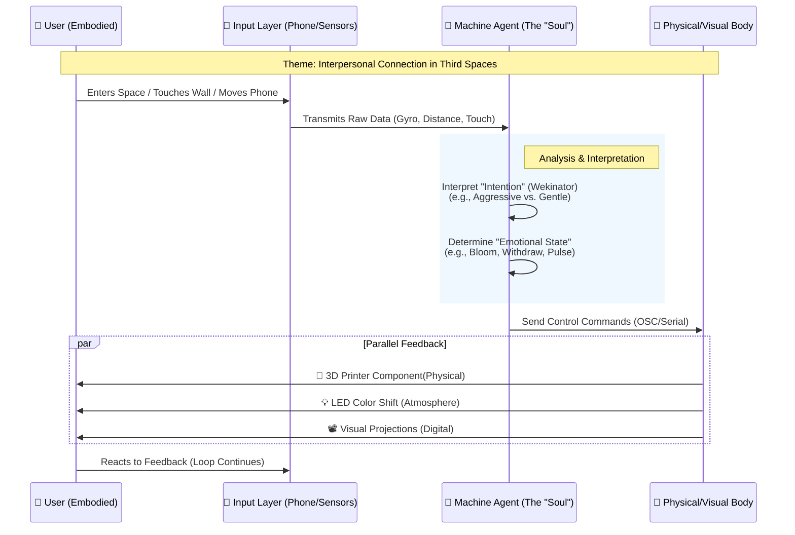
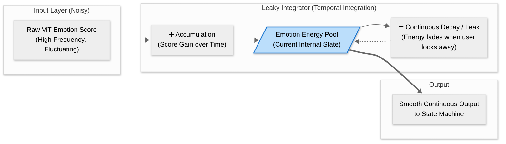
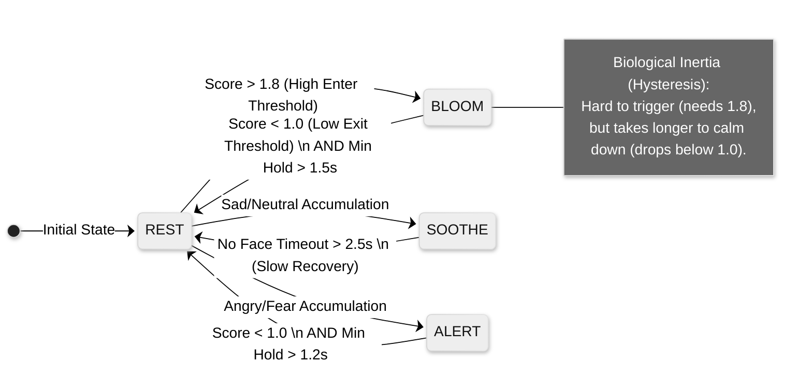
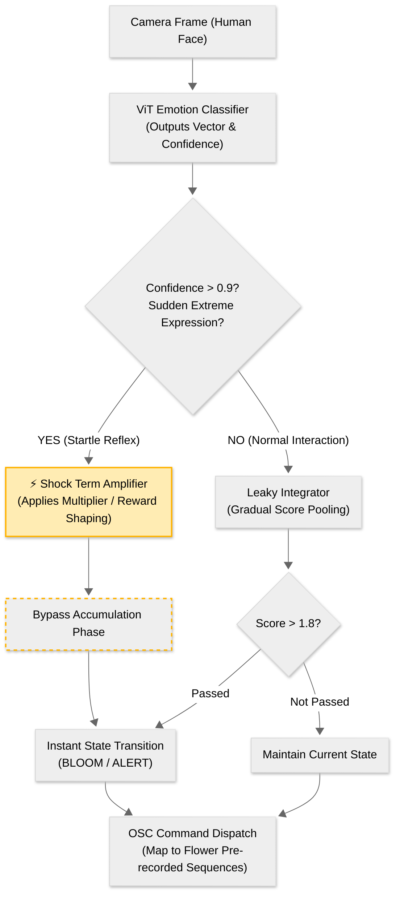
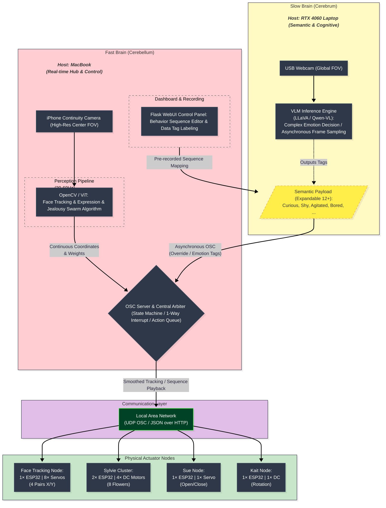

# The Garden's Response - Interactive AI Flower Installation 
## 机械花朵交互式AI艺术装置

English Versin：[PORTFOLIO_EN.md](./PORTFOLIO_EN.md)

tag: esp32, physical computing, robtics, computer vision, ui/ux...

## 项目概述

**The Garden's Response** 是 York University Digital Media Program **DATT 3700: Collaborative Project Development** 课程中的互动机械花装置。项目被选中参加 **YES!! - Year End Showcase!!**，在 InterAccess / Digital Media Year 2026 展出：[Digital Media Gallery - YES!! Year End Showcase](https://dmgallery.apps01.yorku.ca/yes-year-end-showcase/)。

这个作品将 Python 感知控制端、表情识别、OSC 网络通信与多个 ESP32 物理节点结合起来。主机通过摄像头追踪人脸并分析情绪，再把数字感知结果转译为机械花的伺服、电机、屏幕动画和预设动作，让花朵以一种具身的方式回应观众。

> Showcase 官方描述：The Garden's Response is an interactive kinetic flower installation that integrates computer vision, emotion AI, and distributed hardware nodes. The system utilizes a central Python-based host to track human faces and analyze emotional states, translating these digital perceptions into physical movements across a network of ESP32-powered flower nodes.

### 项目链接

- Showcase 页面：[YES!! Year End Showcase - The Garden's Response](https://dmgallery.apps01.yorku.ca/yes-year-end-showcase/)
- 主仓库：[dattodigm/DATT3700](https://github.com/dattodigm/DATT3700)
- 调试控制面板在线演示：https://esp32garden.saikoro.me/
  - 分支源码：[v0/kaminodice-06183338](https://github.com/dattodigm/DATT3700/tree/v0/kaminodice-06183338)
- GC9D01/TFT_eSPI 显示驱动仓库：[Arduino_GC9D01_Driver_TFT_eSPI_Lvgl](https://github.com/dattodigm/Arduino_GC9D01_Driver_TFT_eSPI_Lvgl)
- RGB565 眼睛动画预览/转换工具：[EyeSeed](https://github.com/dattodigm/EyeSeed)

## 系统架构

```text
Camera / iPhone Continuity Camera
        |
        v
Python Host (Flask + OpenCV + optional ML)
        |
        |-- FaceTracker: Haar 人脸检测，多人人脸面积加权中心
        |-- PerceptionModule: DeepFace、MediaPipe 预留、ViT 表情识别
        |-- EmotionReactor: 有损积分、状态机、OSC 路由
        |-- Web Dashboard: 实时预览、控制面板、动作录制、OSC Console
        |
        v
OSC over WiFi / USB serial fallback
        |
        v
ESP32 Flower Nodes
        |
        |-- Sylvie: AP/gateway、DC 电机、RGB LED、预设动作
        |-- Kait: DC 电机速度与运动模式
        |-- Sue: 舵机花朵开合、GC9A01 眼睛、眨眼/呼吸/追踪
        |-- Face Tracking Node: 8 舵机、4 组 pan/tilt 花朵追踪
        |-- Eye Anime Node: GC9D01/TFT_eSPI 眼睛动画与追踪
```



## 核心实现

### Python 控制端与 Web Dashboard

主机端代码在 `python_host/`。基础运行方式：

```bash
python -m pip install -r python_host/requirements.txt
python -m python_host.main --port 15000
```

`python_host/ui/app.py` 中的 Flask 应用提供：

- 摄像头生命周期管理：启动、停止、切换摄像头，以及镜像预览对应的 X 方向反转。
- mDNS 设备扫描与 Gateway fallback 扫描。
- 通过 `python_host/ui/device_registry.json` 做节点类型识别与已知设备注册。
- 根据节点类型渲染不同控制面板：`sylvie`、`kait`、`sue`、`face_track`、`eye_anime`。
- Raw OSC Console、发送历史和自动刷新。
- 动作序列录制与回放，保存到 `python_host/data/sequences/<label>`。
- 人脸追踪坐标输出，可切换 OSC/WiFi 或 USB Serial。
- 调试 API：设备发现、追踪配置、表情状态、情绪反应器调参、串口命令、OSC 原始命令等。

### 人脸追踪

`python_host/vision/face_tracker.py` 使用 OpenCV Haar Cascade 作为实时追踪基础。它会检测画面中的所有人脸，选择面积最大的人脸作为 primary target，同时计算所有人脸的面积加权中心作为 tracking target。

这种加权目标对展览现场很实用：当多个观众同时进入画面时，花朵不会在不同人脸之间剧烈跳动，而是会更平滑地朝向人群的视觉重心。

`python_host/network/coordinate_publisher.py` 负责把归一化坐标以固定频率发布出去，并通过 deadband 降低无意义的小抖动。坐标可以通过 OSC `/track/norm` 发给节点，也可以通过 USB Serial 发送像素坐标用于本地调试。

### 表情识别与感知

`python_host/vision/perception.py` 把 ML 推理放在后台线程中运行，避免阻塞摄像头预览和 Web UI。

已经接入的感知路径：

- OpenCV 人脸追踪，用于低延迟目标提取。
- DeepFace 表情识别，用于常规人脸表情分析。
- ViT 表情识别，通过 `python_host/vision/vit_emotion.py` 调用 Hugging Face 模型 `yst007/vit-emotion`。

保留但未完成的方向：

- MediaPipe face mesh / pose 已经做了懒加载与接口预留，但没有完成更丰富的手势到运动参数映射。
- 眼动追踪、VLM 高层决策、视频流反馈训练等属于后续研究方向，没有在课程周期内继续投入。

### 有损积分的花朵情绪算法

核心行为逻辑在 `python_host/vision/emotion_reactor.py`。我没有把每一帧表情识别结果直接映射到电机，因为表情分类器会有噪声，物理装置也不适合像 UI 元素一样高频抖动。

Emotion Reactor 会：

- 将人类表情映射为花朵状态：`BLOOM`、`ALERT`、`SOOTHE`、`REST`；
- 根据置信度给每个状态累积分数；
- 持续对历史分数做衰减，让旧情绪逐渐消失；
- 使用进入阈值、退出阈值、最小保持时间、shock scale、burst transition 和 cooldown；
- 当状态稳定后，再根据节点类型发送对应 OSC 指令。

这个“有损积分”方法是我认为项目中最重要的创新之一。它让机械花不会因为分类器的小错误而乱动，同时又能在观众出现明显表情时产生可感知的反应。






### ESP32 固件节点

生产使用的节点固件在 `esp32_firmware/node/`。

关键节点：

- `esp32_firmware/node/sylvie/sylvie_main/sylvie_main.ino`  
  Sylvie 主节点，支持 AP/gateway 行为、OSC、mDNS、客户端信息查询、双 DC 电机、RGB LED 和预设动作。

- `esp32_firmware/node/sylvie/sylvie_client/sylvie_client.ino`  
  Sylvie 从节点，用于配合集群花朵运动。

- `esp32_firmware/node/kait/kait_v2_en/kait_v2_en.ino`  
  Kait 节点固件，支持 DC 电机速度、方向、运动模式、OSC 控制和串口调试。

- `esp32_firmware/node/sue/sue_main/sue_main.ino`  
  Sue 节点固件，整合舵机花瓣开合、GC9A01 眼睛绘制、OSC 追踪、眨眼/呼吸/瞳孔行为、WiFi 重连、mDNS 和串口诊断。

- `esp32_firmware/node/face_tracking/face_tracking.ino`  
  8 舵机 pan/tilt 追踪节点，控制四朵花的朝向，包含平滑、角度限位、手动/自动模式融合、OSC 路由、mDNS metadata 和 WiFi 恢复。

- `esp32_firmware/node/gc9d01_eye/5.Animated_Eye12.ino`  
  基于 GC9D01/TFT_eSPI 的 Animated_Eye 风格固件，扩展了 OSC 追踪和动画模式。

固件的重点不是追求抽象完美，而是展览可靠性：舵机安全角度、非阻塞更新、网络重试、串口 fallback、`/info/self`、`/info/servo`、mDNS metadata 和 raw OSC 可调试性。

### 显示与 RGB565 工具链

显示模块是项目中单独的一条技术线。我移植并测试了 GC9D01/TFT_eSPI 相关行为，逆向理解了 Animated_Eye 类资源的显示逻辑，并写了转换/预览工具来降低反复烧录的时间成本。

本仓库工具：

- `tools/images_to_rgb565_header.py`：把图片序列转换为 RGB565 `PROGMEM` 头文件。
- `tools/h_to_gif_preview.py`：解析 RGB565 C 头文件，预览动画或导出 GIF。

关联公开仓库：

- [EyeSeed](https://github.com/dattodigm/EyeSeed)：方便代码能力不足的艺术方向队友可以免反复刷写固件代码就能实时预览显示效果的浏览器端 RGB565 / Uncanny Eyes 风格头文件预览器。
- [Arduino_GC9D01_Driver_TFT_eSPI_Lvgl](https://github.com/dattodigm/Arduino_GC9D01_Driver_TFT_eSPI_Lvgl)：GC9D01/TFT_eSPI 驱动移植和示例库。

## Web Dashboard 设计

当前 Flask Dashboard 的目标是现场调试和稳定演示，而不是单纯展示好看界面。

我设计了这些面板与交互：

- 实时镜像摄像头预览，并同步反转追踪发布的 X 坐标，符合观众对“镜子”的直觉。
- 模仿 iOS 摄影/对焦手感的 2D 面板，用来控制 face tracking 节点的水平/垂直舵机。
- Sylvie 双电机控制：正负速度、deadband、最小驱动力、停止按钮和 2D drive pad。
- Sue 控制：花朵开闭程度、运动速率、眼睛开合、眼动 2D pad、眼动限位、眨眼、呼吸、瞳孔自动旋转。
- Kait 控制：电机速度和预设动作模式。
- Emotion Reactor 的 safe / balanced / dramatic 调参预设。
- mDNS、Gateway、Manual Add 三种发现方式，以及每个节点是否接收情绪路由的勾选。
- Raw OSC Console 和历史记录，用于命令级调试。
- 动作序列录制与回放，用于采集带标签的运动数据和复现编舞。

另外，我在 [v0/kaminodice-06183338](https://github.com/dattodigm/DATT3700/tree/v0/kaminodice-06183338) 分支用 v0 做了更现代的 Next.js 前端。这个版本适合放在简历 Portfolio / Vercel 展示，但因为没有和原 Flask 路由完整回归测试，合并到稳定主分支会带来额外风险，所以目前只作为展示版本保留。

## Showcase 现场可靠性插曲

实际 Showcase 展示过程中发生过一次很典型的现场工程问题：由于展示要求不能把藏在箱子里的电脑露出来，第二天笔记本工作站在箱子里闷太久过热关机。

系统能很快恢复，是因为架构上把“主机大脑”和“ESP32 身体节点”解耦了：

1. 备用 MacBook 连入同一个花朵 WiFi mesh/network。
2. 在备用机器上重新运行 `python_host` 和 Web Dashboard。
3. 使用 iPhone Continuity Camera 作为摄像头输入，并隐藏在花朵装饰草丛中。
4. ESP32 节点无需重刷固件，也无需重新接线，继续接收 OSC 指令。

这个小事故反而验证了项目架构的健壮性：只要网络和节点仍在，控制主机可以快速替换。

## 仓库结构

```text
DATT3700/
|-- python_host/
|   |-- main.py                         # 主机入口
|   |-- README.md                       # Host setup 与 API 说明
|   |-- ui/
|   |   |-- app.py                      # Flask Dashboard 与 API
|   |   |-- templates/index.html        # 控制面板 UI
|   |   |-- device_registry.json        # 节点类型与已知设备
|   |   `-- static/panel-fallback.css
|   |-- vision/
|   |   |-- face_tracker.py             # OpenCV 人脸追踪
|   |   |-- perception.py               # DeepFace / ViT / MediaPipe hooks
|   |   |-- vit_emotion.py              # Hugging Face ViT detector
|   |   `-- emotion_reactor.py          # 有损情绪池化与路由
|   |-- network/
|   |   |-- osc_sender.py               # OSC target 管理与历史
|   |   |-- node_discovery.py           # mDNS 与 gateway discovery
|   |   |-- coordinate_publisher.py     # 追踪坐标发布
|   |   `-- serial_sender.py            # USB serial 调试路径
|   `-- tests/
|
|-- esp32_firmware/
|   |-- node/
|   |   |-- sylvie/
|   |   |-- kait/
|   |   |-- sue/
|   |   |-- face_tracking/
|   |   `-- gc9d01_eye/
|   |-- original/                       # 队友提供的原始 sketch
|   `-- refactor_example/               # 早期抽象实验
|
|-- tools/
|   |-- images_to_rgb565_header.py
|   `-- h_to_gif_preview.py
|
`-- docs/
    |-- PORTFOLIO_EN.md
    |-- PORTFOLIO_ZH.md
    `-- deprecated/                     # 旧课程交付文档
```

## 技术挑战与解决

| 挑战 | 解决方式 |
|---|---|
| 表情识别结果有噪声，直接驱动电机会抖动。 | 设计有损积分情绪反应器，加入衰减、阈值、保持时间、shock scale 和 cooldown。 |
| 多人进入画面时，追踪目标容易跳。 | 使用面积加权中心，同时保留 primary face overlay 便于调试。 |
| ESP32 节点硬件能力不同、OSC 命令不同。 | 用 device registry、按节点类型渲染 UI、按节点类型路由 OSC。 |
| 展览布置时调试 WiFi 设备成本高。 | 加入 mDNS、Gateway fallback、Raw OSC history、`/info/self`、`/info/servo` 和串口 fallback。 |
| Sue 节点屏幕全屏绘制撕裂。 | 改为 Canvas 缓冲，再因全屏 Canvas 内存溢出改为局部精灵图重绘。 |
| 隐藏主机在 Showcase 期间过热关机。 | 备用 MacBook 快速接入同一网络，复用 Python host、Dashboard 和 iPhone 相机继续展示。 |

## 当前状态

已经稳定用于 Final Presentation 和公开 Showcase 的部分：

- 人脸追踪、Web Dashboard、OSC 路由、串口调试可用。
- DeepFace 与 ViT 表情识别已接入。
- 花朵情绪池化与运动路由已实现。
- Sylvie、Kait、Sue、face tracking、eye animation 节点均有可用固件。
- Dashboard 中的动作序列录制与回放已实现。
- RGB565 / GC9D01 显示工具链可用。

有意冻结或未合并的部分：

- Next.js/v0 现代前端只作为 Portfolio 展示版，尚未完整接入 Flask 后端。
- MediaPipe 手势到运动参数映射仍是后续方向。
- 固件抽象曾经做过实验，但没有在所有节点上完全统一。

## 后续路线图

如果这个项目从课程作品继续发展成长期平台，我会优先考虑：

- 双/多摄像头控制。
- 群体嫉妒算法或多花朵社会性行为。
- 采集更多情绪与预设动作序列，用于 ML 训练。
- 固件抽象与跨节点统一模块。
- 更精简稳定的热点 / Mesh 网络模块，或使用 ESP-NOW / 更低延迟协议替代当前 OSC 路径。
- MediaPipe 姿态与手势识别，把人的身体动作映射到花朵运动参数。
- 眼动追踪和注视时长驱动行为。
- 快慢脑双脑架构：实时追踪作为快脑，高层推理作为慢脑。
- VLM 集成：图片序列化、拼图摘要、高层决策。
- 视频流反馈、自主调试和离线训练闭环。
- 将现代 Next.js Dashboard 与 Python Host API 完整联调。





# Credits：
- ViT 参考实现：[yst002/EmotionDetector_deployment](https://github.com/yst002/EmotionDetector_deployment)
- ViT 权重：[yst007/vit-emotion](https://huggingface.co/yst007/vit-emotion/tree/main)
- 眼睛动画和 TFT 显示部分基于 Adafruit Uncanny Eyes 与 TFT_eSPI 生态进行学习、适配和二次开发。


## 我的职责

这是一个小组装置项目，但最终的软件集成、控制架构、调试面板和大部分工程化工作主要由我完成。

以下文件/目录是队友提供的原始固件，我在仓库中保留作为来源参考：

- `esp32_firmware/original/esp32_sylvie/sylvie_origin.c`
- `esp32_firmware/original/esp32_kait/esp32_kait.ino`
- `esp32_firmware/original/Face_tracking`
- `esp32_firmware/original/esp32_sue`

我的主要贡献包括：

- Python 控制端、Flask Web Dashboard、OSC 路由、串口调试、设备发现和动作序列录制。
- OpenCV 人脸追踪与多人人脸的面积加权目标池化。
- DeepFace 表情分析接入。
- ViT 表情分析接入：参考外部实现，并使用托管在 Hugging Face 的 `yst007/vit-emotion` 权重。
- “有损积分”花朵情绪算法：对人类表情做积累、衰减、阈值判断、状态切换和节点路由。
- ESP32 固件整合：WiFi AP/STA、mDNS、OSC 命令、串口回退调试、物理安全限位、节点发现与信息查询。
- Web 调试面板的 UI/UX：按节点类型渲染不同控制器，包括人脸追踪舵机、Sylvie 双电机、Sue 花朵开合/眼睛控制、Kait 动作模式、Raw OSC Console、动作录制与回放。
- GC9D01 显示驱动移植、Uncanny Eyes / Animated_Eye 示例逆向、RGB565 二进制转换工具，以及与人脸追踪眼动的整合。
- Sue 节点屏幕撕裂与内存问题修复：从全屏绘制改为 Canvas，再在全屏 Canvas 内存溢出后改为精灵图局部重绘，最终解决画面撕裂和内存限制问题。

---

<div align="center">

**Made with ❤️ for DATT3700**  
*Bringing digital eyes to botanical follower installations 🎨👁️🌸*

Team project by Emma Su, Huanrui Cao, Kaitlyn Ly, Sawsan Al Sharafa, and Xiwei Ma.

</div>